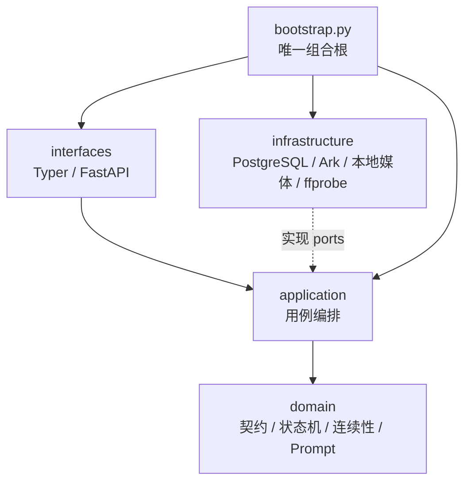

# ADR-001：显式状态机与模块化单体

状态：已采用。

## 决策

系统采用：

```text
显式 Python 状态机
+ PostgreSQL 工作流
+ Pydantic 业务契约
+ Ark 导演 / 图片 / 视频 / 视觉审核边界
+ 本地不可变媒体
+ Typer / FastAPI 接口
```

不采用 LangGraph、AgentScope、Celery、Redis 或微服务。工作量为每天三个 Episode，PostgreSQL 已能提供幂等、锁、恢复和审计；增加新的编排框架只会制造第二状态源。

## 分层与依赖



强制方向：

- Domain 不依赖 SQLAlchemy、Typer、FastAPI、Ark SDK 或文件系统。
- Application 只依赖 Domain 和实际需要的 Port。
- Infrastructure 实现 Port，不决定业务状态。
- CLI/API 只解析输入、调用 Application、格式化结果。
- `bootstrap.py` 是唯一装配位置。

不以机械行数驱动拆文件。超过 500 行提示人工审查；Ruff 圈复杂度上限 12；禁止只改名、格式化路径或转发参数的薄包装。

## 当前模块所有权

```text
domain/
  contracts.py      DayBrief、EpisodeScript、EpisodePlan
  continuity.py     SceneContinuity轻量起终态与引用检查
  rendering.py      VideoInputPlan 与素材顺序
  prompts.py        导演、图片、视频和审核 Prompt
  rules.py          规划准入硬门
  snapshots.py      Director/Image/Video 类型化输入快照
  workflow.py       Run/Episode/Step 状态转换

application/
  planning.py             四次导演调用与局部重规划
  visual_preparation.py   日内定妆、精确参考选择、故事板组图和整组语义审核
  video_execution.py      Seedance、下载和技术 QC
  production.py           状态编排
  retry.py                显式 attempt 与防重复收费
  assets.py/reviews.py    Canon、参考和人工审核
  delivery.py/queries.py  交付与统一只读投影
```

`application/ports.py` 提供 `PlanningStore`、`ProductionStore`、`QueryStore` 三种能力协议。Application Service 只依赖其真正使用的能力；基础设施可由同一 Repository 实现它们。

## 单一事实模型

```text
EpisodePlan
├─ slot
└─ script: EpisodeScript
   ├─ mainEvent / scene / appearance / ending
   ├─ actions[]
   ├─ shots[]
   ├─ durationSeconds
   └─ continuity
```

`SceneContinuity`只保存真正参与交互的锚点，以及关键实体的起点、终点、生命周期和稳定类别。普通背景不进入账本；动作姿态不做物理状态建模，也不执行逐动作重放。未知引用、关键实体缺失、无原因消失或变类会阻断；座位、服饰和道具的实际画面连续性由故事板语义审核把关，渲染难度只形成诊断。

`VideoInputPlan` 只保存输入模式、分辨率、时长和有序素材绑定。模型位于 WorkflowStep；素材别名由模态和序号确定性生成；原生音频和 Prompt 方言属于产品配置与 Step 快照。

## PostgreSQL

八张核心表：

```text
production_runs
episodes
workflow_steps
prompt_records
assets
reviews
delivery_packages
delivery_items
```

- `production_runs.planning_json` 保存 DayBrief、导演选择和恢复信息。
- `episodes.script_json` 只保存 EpisodeScript；slot、排序和状态使用关系字段。
- `workflow_steps` 只允许 director、image、video，保存正式 operation_key、attempt、幂等键、Task ID、模型、输入哈希和类型化输入快照。
- Prompt 正文使用 TEXT；视频二进制不进入 PostgreSQL。
- 旧运行数据已按用户要求从运行库清除；新Schema只接受故事板优先的新Run。

## 不变量

1. Prompt 和收费意图先落库，再调用 Ark。
2. 幂等键包含 Episode、StepKind、operationKey、attempt 和规范化输入哈希。
3. `submission_unknown` 禁止自动重复 POST。
4. 终态失败只能通过显式 `retry-step` 产生递增 attempt；`run-day` 不隐式收费重试。
5. Ark 轮询、下载和 ffprobe 期间不保持事务。
6. 媒体先写 `.part`，完整下载并校验 SHA-256 后原子改名。
7. 资产审核锁定 Asset、Step 和 Episode 并在一个事务中提交。
8. 新Run只选择精确`semantic_key`的最新已批准Canon；人物使用大头照与全身照，日内外观先资产化，相同外观复用定妆图；每条只有一个故事板组图Step。
9. Seedance只接收批准故事板并走single-pass；视频完成后进入人工`content_review`。
10. JobRegistry 只管理 HTTP 异步执行，不成为工作流事实来源。
11. Ark返回可解析脚本但语义审核失败时进入`planning_review`；只有结构解析失败允许一次自动导演修复。
