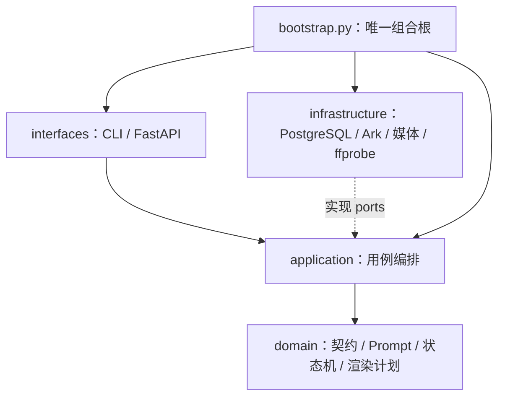

# ADR-001：显式状态机与模块化单体

状态：已采用。

## 决策

系统使用显式Python状态机、PostgreSQL、Pydantic、Ark网关、本地不可变媒体、
FastAPI和Vue。日生产规模只有三个Episode，不引入LangGraph、AgentScope、
Celery、Redis或第二套检查点。



Domain不依赖框架或I/O；Application只依赖Domain和所需Port；Infrastructure不
决定业务状态；接口层不直接写数据库或调用Ark。禁止只改名、转发参数或格式化
路径的薄包装。

## 唯一生产模型

```text
RunCreativeControls
→ DayBrief
→ EpisodeScript × 3
→ RenderPlan（确定性推导）
```

`EpisodeScript`采用极简混合契约：完整长剧情是创作事实主体，活动焦点、时长、外观、
关系弧、1～3段完整镜头描述和少量`hardConstraints`构成机器可读控制壳。镜头段落一次
说明景别、机位、唯一运镜、站位、动作路径、接触结果和稳定切点；不会把同一剧情再
拆成动作表和重复镜头字段。连接、承重、容器、接触、交接和穿戴等真正影响出片正确性
的关系才进入硬约束，并由同一来源投影到图片、视频和审核Prompt。

系统不保存世界状态模拟、故事板面板、供应商输入模式、重复道具起终表或数据库资产ID。
默认关系为猫咪推动主要可见信息、人物完成副活动或回应、两条线汇合回报。

`RenderPlan`按精确时长确定性生成：8～15秒一个初始任务；16～30秒增加一次官方
延展；31～45秒增加两次延展。首段只用批准开场锚点，延展只用上一版视频。模型
不支持延展时在收费前失败，不自动换模型。供应商延展返回新增尾段，因此媒体边界
只负责区段级QC与FFmpeg `stream copy`顺序封装；不重新编码，也不引入逐镜或
`multi_clip`创作路径。

## 模块所有权

```text
domain/contracts.py    DayBriefV2、EpisodeScriptV2、创作控制与极简导演壳
domain/rendering.py    RenderPlan、VideoInputPlan与延展能力
domain/prompts.py      导演、定妆、开场锚点、视频和审核Prompt
domain/rules.py        少量身份、时长与跨时段硬门
domain/workflow.py     Run/Episode/Step合法状态转换

application/planning.py            四次顺序导演调用与局部重规划
application/visual_preparation.py  定妆图、开场锚点和图片审核
application/video_execution.py     初始生成、官方延展、恢复、下载和QC
application/production.py          流程编排
application/retry.py               显式attempt、恢复和对账
```

## PostgreSQL与不变量

八张核心表保持为`production_runs / episodes / workflow_steps / prompt_records /
assets / reviews / delivery_packages / delivery_items`。

1. 收费意图和实际Prompt先在同一短事务落库，再调用Ark。
2. PostgreSQL是唯一工作流状态源；JobRegistry只展示本进程异步任务。
3. 幂等键包含操作、attempt和规范化输入哈希。
4. `submission_unknown`冻结；已有Seedance Task ID只查询，不重复POST。
5. 终态失败只能显式创建新attempt，`run-day`不暗中重试收费任务。
6. 媒体通过`.part`下载、哈希校验和原子改名落盘。
7. 图片和视频人工决定不可覆盖；相反决定必须产生新attempt。
8. 最终视频停在`content_review`，三条人工批准后才能交付。
9. 导演原始结构化JSON、可选归一化结果和警告保存在Step快照；查询层只在打开节点时
   投影完整Trace，禁止把Key、Base64、签名URL或SDK对象写入数据库。
10. 高级Prompt覆盖绑定当前脚本哈希；上游脚本变化后自动失效，旧attempt Prompt永久保留。
