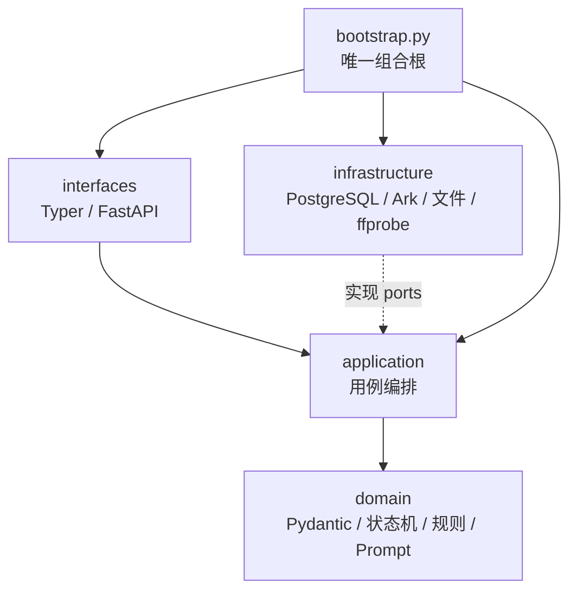

# ADR-001：显式状态机与模块化单体

状态：已采用。

## 决策

系统采用：

```text
显式Python状态机
+ PostgreSQL工作流
+ Pydantic业务契约
+ Ark外部网关
+ 本地不可变媒体
+ FastAPI只读接口
```

不采用 LangGraph、AgentScope 或 PydanticAI 作为工作流引擎。

- LangGraph 的持久化检查点会与现有 PostgreSQL 工作流形成第二状态源。
- AgentScope 重点是多 Agent 消息、工具调用和协作，本系统没有该需求。
- PydanticAI 的 Agent 工具循环不是结构化输出校验的必要条件；直接使用
  Pydantic 模型更清楚。

参考：[LangGraph 概览](https://docs.langchain.com/oss/python/langgraph/overview)、
[AgentScope](https://github.com/agentscope-ai/agentscope)、
[PydanticAI](https://ai.pydantic.dev/)。

## 模块与依赖



目录：

```text
src/cat_video_generator/
├─ domain/
│  ├─ contracts.py
│  ├─ workflow.py
│  ├─ rules.py
│  ├─ media.py
│  └─ prompts.py
├─ application/
│  ├─ ports.py
│  ├─ planning.py
│  ├─ production.py
│  ├─ assets.py
│  ├─ delivery.py
│  └─ queries.py
├─ infrastructure/
│  ├─ db/
│  ├─ ark/
│  └─ media/
├─ interfaces/
│  ├─ cli.py
│  └─ api.py
├─ bootstrap.py
└─ config.py
```

### 领域层

只负责当前 `DayBrief`、`DailyProductionPlan`、`EpisodePlan`、`VideoInputPlan`、
状态转换、能力边界、四道硬门与Prompt编译。不得依赖SQLAlchemy、Typer、
FastAPI、Ark SDK或文件系统。

### 应用层

负责编排导演候选、图片、视频、审核和交付。允许的外部协议只有：

- `DirectorGateway`
- `MediaGenerationGateway`
- `WorkflowRepository`
- `AssetStore`
- `MediaProbe`

应用方法不在外部 HTTP 调用期间持有数据库事务。

### 基础设施层

- `db`：八表模型、并发幂等查询、Schema 迁移。
- `ark`：Responses、Seedream、Seedance 参数映射与错误分类。
- `media/storage.py`：`.part`、SHA-256、原子改名、交付目录。
- `media/qc.py`：Pillow 与 ffprobe 技术检查。

### 接口层

CLI 和 HTTP 只解析输入、调用 Application、格式化结果。它们不导入 ORM 模型、
不直接调用 Ark、不直接转换业务状态。

## 数据模型

八张核心表：

```text
production_runs
episodes
workflow_steps
prompt_records
assets
reviews
delivery_packages
delivery_items
```

`workflow_steps` 同时保存收费意图、幂等键、Ark task ID、输入摘要和错误状态。
Prompt 使用独立 `TEXT` 字段；JSONB 只保存紧凑方案、扩展元数据和审核证据。
视频二进制不进入 PostgreSQL。

## 关键不变量

1. 所有 Prompt 先落库，再调用 Ark。
2. 幂等键包含 Run、Episode、步骤类型、attempt 和规范化输入哈希。
3. `submission_unknown` 不自动重试收费 POST。
4. Ark 轮询、下载、ffprobe 期间不保持事务。
5. 媒体写入 `.part`，完整下载、fsync、哈希后才原子改名。
6. CLI、API、Gateway 均不能直接决定业务状态。
7. 非迁移 Python 模块超过 600 行会被架构测试阻断。
8. 全天规划固定为一个总导演步骤和三个顺序时段导演步骤；中午读取上午状态，
   傍晚读取上午和中午状态。
9. 总导演只定边界，时段导演只细化一个 Episode，局部失败不重写 DayBrief。
10. Prompt素材别名、Ark content顺序和幂等哈希必须来自同一个`VideoInputPlan`。
11. 严格首尾帧与多模态参考互斥；不允许Gateway静默丢弃不支持的素材。

## 注释规范

公共契约、状态入口、收费意图、幂等、短事务、未知提交、锁与原子文件操作使用
简洁中文 Docstring 或注释，说明“为什么、不变量、失败如何恢复”。不做逐行翻译式
注释。
