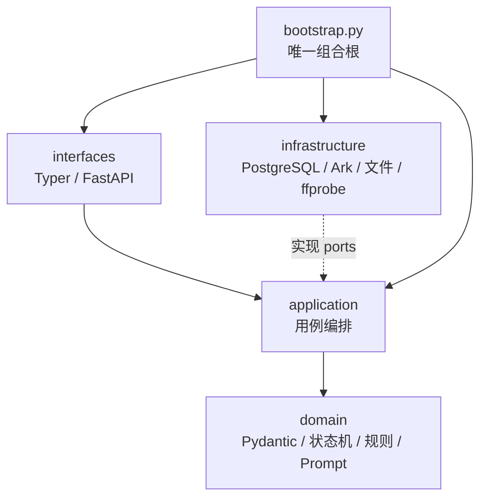
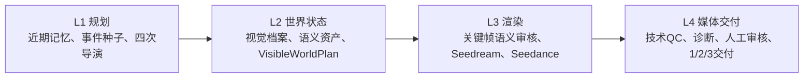

# ADR-001：显式状态机与模块化单体

状态：已采用。

## 决策

系统采用：

```text
显式Python状态机
+ PostgreSQL工作流
+ Pydantic业务契约
+ Ark导演/媒体/视觉审核网关
+ 本地不可变媒体
+ Typer/FastAPI接口
```

不采用 LangGraph、AgentScope 或 PydanticAI 作为工作流引擎。

- LangGraph 的持久化检查点会与现有 PostgreSQL 工作流形成第二状态源。
- AgentScope 重点是多 Agent 消息、工具调用和协作，本系统没有该需求。
- PydanticAI 的 Agent 工具循环不是结构化输出校验的必要条件；直接使用
  Pydantic 模型更清楚。

参考：[LangGraph 概览](https://docs.langchain.com/oss/python/langgraph/overview)、
[AgentScope](https://github.com/agentscope-ai/agentscope)、
[PydanticAI](https://ai.pydantic.dev/)。

## 模块与依赖



目录：

```text
src/cat_video_generator/
├─ domain/
│  ├─ contracts.py
│  ├─ workflow.py
│  ├─ rules.py
│  ├─ media.py
│  ├─ visual_profiles.py
│  ├─ continuity.py
│  ├─ continuity_support.py
│  ├─ prompts.py
│  └─ review_prompts.py
├─ application/
│  ├─ ports.py
│  ├─ planning.py
│  ├─ director_execution.py
│  ├─ event_seeds.py
│  ├─ production.py
│  ├─ visual_preparation.py
│  ├─ video_execution.py
│  ├─ video_landing.py
│  ├─ video_diagnostic.py
│  ├─ multi_clip_finalization.py
│  ├─ resolution_comparison.py
│  ├─ retry.py
│  ├─ assets.py
│  ├─ delivery.py
│  └─ queries.py
├─ infrastructure/
│  ├─ db/
│  ├─ ark/
│  └─ media/
│     ├─ storage.py
│     ├─ qc.py
│     └─ finalizer.py
├─ interfaces/
│  ├─ cli.py
│  └─ api.py
├─ bootstrap.py
└─ config.py
```

### 领域层

只负责 `DayBrief`、`EpisodePlan`、`VisibleWorldPlan`、视觉档案、
`VideoInputPlan`、状态转换、能力边界、连续性规则与 Prompt 编译。不得依赖
SQLAlchemy、Typer、FastAPI、Ark SDK或文件系统。

### 应用层

负责编排规划、图片、视频、审核和交付。外部边界协议包括：

- `DirectorGateway`
- `MediaGenerationGateway`
- `VisualReviewGateway`
- `WorkflowRepository`
- `AssetStore`
- `MediaProbe`
- `MediaFinalizer`

应用方法不在外部 HTTP 调用期间持有数据库事务。

职责进一步收敛：

- `PlanningService`只处理近期记忆、事件种子和四次导演调用。
- `VisualPreparationService`拥有精确资产选择、关键帧生成和语义审核。
- `VideoExecutionService`拥有Seedance任务、下载、技术QC和显式双片段执行。
- `ProductionService`只编排状态，不复制上述外部边界逻辑。
- `VideoDiagnosticService`只产生不阻断人工审核的时序诊断证据。
- `MultiClipFinalization`拥有尾帧链接、兼容性判定和条件式合成，不是参数转发层。

### 基础设施层

- `db`：八表模型、并发幂等查询、Schema迁移和精确语义资产索引。
  最终审核由独立`review_repository.py`持有跨Asset/Step/Episode的原子事务。
- `ark`：共享认证/错误策略，以及彼此独立的导演、媒体和视觉审核实现。
- `media/storage.py`：`.part`、SHA-256、原子改名、交付目录。
- `media/qc.py`：Pillow与ffprobe技术检查。
- `media/finalizer.py`：双片段尾帧抽取、stream copy/remux/条件式转码。

### 接口层

CLI 和 HTTP 只解析输入、调用 Application、格式化结果。它们不导入 ORM 模型、
不直接调用 Ark、不直接转换业务状态。

## 数据模型

八张核心表：

```text
production_runs
episodes
workflow_steps
prompt_records
assets
reviews
delivery_packages
delivery_items
```

`workflow_steps` 同时保存收费意图、幂等键、Ark task ID、输入摘要和错误状态。
Prompt 使用独立 `TEXT` 字段；JSONB 只保存紧凑方案、扩展元数据和审核证据。
视频二进制不进入 PostgreSQL。

## 关键不变量

1. 所有 Prompt 先落库，再调用 Ark。
2. 幂等键包含 Run、Episode、步骤类型、稳定`operationKey`、attempt 和规范化
   输入哈希；升级前历史Step先按完整业务字段兼容复用，避免部署后重复收费。
3. `submission_unknown` 不自动重试收费 POST。
4. Ark 轮询、下载、ffprobe 期间不保持事务。
5. 媒体写入 `.part`，完整下载、fsync、哈希后才原子改名。
6. CLI、API、Gateway 均不能直接决定业务状态。
7. 非迁移 Python 模块超过 600 行会被架构测试阻断。
8. 全天规划固定为一个总导演步骤和三个顺序时段导演步骤；中午读取上午状态，
   傍晚读取上午和中午状态。
9. 总导演只定边界，时段导演只细化一个 Episode，局部失败不重写 DayBrief。
10. Prompt素材别名、语义键、Ark content顺序和幂等哈希必须来自同一个
    `ReferenceSelectionPlan`或`VideoInputPlan`。
11. 新Run只能选择精确`semantic_key`的最新已批准资产；`legacy:*`不得自动复用。
12. `VisibleWorldPlan`是单条视频中实体、承重、包含、接触和切镜继承的事实来源。
13. 严格首尾帧与多模态参考互斥；Gateway不得静默丢弃必需素材。
14. 关键帧技术QC和语义审核是两种不同证据；技术通过不能冒充语义通过。
15. `single_pass`是默认路径。`multi_clip`最多两段，必须有人工拒绝的前序单次成片
    和再次显式付费许可，不是自动重试策略。
16. 视频语义诊断只保存帧哈希、时间和诊断，不自动把视频推进到`ready`。
17. 只有真实世界状态矛盾阻断生产；交互次数、拓扑变化和跨镜头动作只形成非阻断
    渲染风险。
18. 终态失败只能通过显式`retry-step`创建递增attempt；`run-day`不隐式重试。
19. 资产最终审核锁定Asset、Step和Episode并一次提交；相反结论不可覆盖。

## L1-L4所有权



L1可以提出创意，但不能跳过L2的确定性连续性硬门。L2只表达本集可见
事实，不把历史剧情中的物体自动带入当前画面。L3不得修改剧情和世界状态；输入
不完整时在收费Step前失败。L4不补写剧情，只验证和封装已经生成的媒体。

## 注释规范

公共契约、状态入口、收费意图、幂等、短事务、未知提交、锁与原子文件操作使用
简洁中文 Docstring 或注释，说明“为什么、不变量、失败如何恢复”。不做逐行翻译式
注释。
