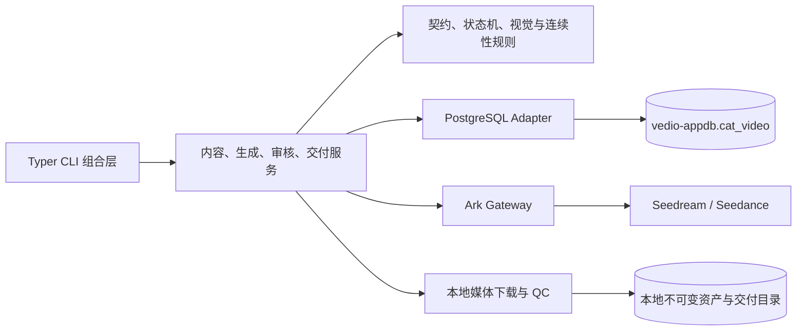

# 代码模块与依赖边界

## 架构决策

项目保持模块化单体：单一 Python 包、单一 PostgreSQL Schema、单一 Windows CLI 进程。每天只有三个视频任务，不引入 HTTP 服务、消息队列、Redis、Celery 或微服务。

当前选择接受的权衡：

- PostgreSQL 保存计划、任务和媒体元数据，本地文件系统保存二进制。
- Ark 是唯一运行时供应商；测试替身只存在于自动测试。
- 通过显式开关暂时允许正式 Schema 使用明文连接，后续切换 TLS 不改变表和数据。
- 单 Worker 顺序处理三条内容；数据库幂等键和短事务仍防止重复收费。

## 真实职责

### CLI

根 `cli.py` 只加载 `.env`、组合 Typer 命令和启动应用。命令模块负责参数解析与 JSON 输出；公共数据库上下文负责连接安全门、Alembic preflight 和 engine 释放。

CLI 不直接修改状态机，也不拼接复杂状态查询。

### PackGenerationService

负责：

- LifePack 和 Slot 顺序。
- approved → frozen → rendering → ready/failed。
- continuation 等待与 fallback。
- 将视觉资产和 Ark 任务结果组合成 Slot 进度。

它不拥有供应商重试、视频下载或图片审核查询。

### VisualAssetService

负责：

- 按版本读取已批准人物、猫咪和画风 Canon。
- direct references、首帧和首尾帧三种路径。
- 关键帧存在性、审核状态和固定顺序。
- 将 Seedream 需求提交给任务执行器。

### ArkJobExecutor

负责：

- GenerationJob 幂等意图。
- Seedream/Seedance 提交和有限重试。
- `submission_unknown` 防重复收费。
- List Tasks 候选查询与显式 task ID 对账；不会自动猜测或绑定。
- Seedance状态轮询。
- 临时 URL 下载、SHA-256、ffprobe QC 和 MediaAsset 落库。
- 供应商终态向 Slot/Variant 失败状态的映射。

供应商等待、下载和 ffprobe 期间不保持数据库事务。

### 保持独立的边界

- `contracts/state/visual_policy/render_plan`：纯领域规则，不依赖 Typer、SQLAlchemy 或 Ark SDK。
- `models/db/repository`：数据库映射、连接生命周期和确实需要锁/幂等语义的查询。
- `ark_provider`：火山方舟请求与错误码适配。
- `media`：本地下载、原子落盘、图片检查和视频探测。
- `delivery`：三文件加 Manifest 的原子交付事务。

不建立每张表一个 Repository，也不增加只重命名调用的 Service。

## 后续功能落位

| 能力 | 所属边界 |
| --- | --- |
| 自动剧本和 DailyLifePack 规划 | 新增 planning，输出既有 JSON 契约 |
| 多角度 Canon | content/Canon 服务及 Alembic 迁移 |
| Seedance 参数或模型升级 | RenderPlan 与 Ark Adapter |
| 关键帧策略 | VisualAssetService |
| 重试、恢复和 task 对账 | ArkJobExecutor |
| remux、转码、换音轨 | Media Finalization |
| 音频、人声和爆音 QC | Media QC |
| continuation/fallback | PackGenerationService |
| 01/02/03 本地交付 | Delivery |
| 定时生成 | 外部 Task Scheduler/cron |
| 小程序、HTTP、CDN | 当前范围外 |

## 自动约束

`tests/test_architecture.py` 检查：

- 包内没有循环依赖。
- 领域规则不依赖 CLI、数据库或 Ark SDK。
- 根 CLI 不直接依赖 SQLAlchemy。
- 运行时代码不存在 Mock Provider。

移动代码时表名、字段、Alembic revision、CLI 命令和幂等键保持不变，因此本次模块重构不需要数据库迁移。
