# 本地三时段视频生产与交付系统架构

## 目标与边界

系统每天生产一个 `DailyLifePack`，最终在本地交付三条 9:16 短视频：

- `morning`：当天第一条，`sortOrder=1`。
- `noon`：当天第二条，`sortOrder=2`。
- `evening`：当天第三条，`sortOrder=3`。

三个 Slot 表达内容顺序和生活时段，不承担自动发布时间语义。当前系统只负责生成、下载、质检、保存和交付文件，不实现微信小程序接口、公开媒体 URL、CDN/TOS 上传、定时发布器或其他展示方式。

三条内容共享 `dayContext`，但不强制形成准备、主要事件和归家的完整故事。旅游日可以依次出现海边、市集和缆车；居家日也可以分别记录做早餐、午睡和看夕阳。

`DailyLifePack.date` 是内容日期，不是执行窗口。只要内容包已经批准和冻结，操作者可以在该日期之前、当天或之后触发生成；系统不检查是否到达20:00，也不把“次日”写成固定领取条件。执行时间只进入审计时间戳，不改变 Episode、Slot 排序或连续性规则。

## 总体流程

```mermaid
flowchart LR
    A["Bible、主体素材与可选 LifeChapter"] --> B["DailyLifePack 候选"]
    B --> C["规则检查与人工批准"]
    C --> D["冻结 planRevision"]
    T["任意时刻的手动 CLI 或可选外部调度器"] --> E["按 lifePackId 或内容日期领取"]
    D --> E
    E --> F0["EpisodeSpec 与 RenderPlan"]
    F0 --> F{"视觉风险规则"}
    F -->|低风险| G["批准的主体与画风参考"]
    F -->|精确开场或复杂互动| H["Seedream 合成首帧"]
    F -->|精确结尾| I["Seedream 合成首尾帧"]
    H --> J["场景关键帧审核"]
    I --> J
    G --> K["Seedance 单次完整成片"]
    J --> K
    K --> L["立即下载临时 URL"]
    L --> M["媒体 QC 与人工内容审核"]
    M --> N{"是否满足交付规格"}
    N -->|是| O["原始 MP4 直通保存"]
    N -->|可修复| P["条件式 remux、音轨处理或转码"]
    P --> O
    O --> Q["选择主内容或 fallback"]
    Q --> R["按 1、2、3 构建本地交付包"]
    R --> S["交付成功后追加连续状态"]
```



触发器只负责调用 CLI，不拥有业务状态。Windows PowerShell、Windows Task Scheduler、Linux cron/systemd 或其他自动化平台都必须经过同一个领取事务、幂等键和状态机；没有批准内容时安全退出。

## 分层职责

### 内容层

保存固定 Canon、LifeChapter、DailyLifePack、EpisodeSpec 和 RenderPlan。内容层不知道 Ark 模型 ID、供应商临时 URL和本地文件路径。

### 编排层

负责状态机、依赖判断、fallback 选择、收费尝试上限和幂等恢复。它决定“应该生成什么”和“哪个结果进入交付”，不负责拼接路径或直接处理媒体字节。

### 供应商层

将 RenderPlan 映射为 Seedream 或 Seedance 请求，保存供应商 task ID，轮询任务状态并分类供应商错误。创建请求结果未知时不得盲目重复 POST。

### 媒体层

负责流式下载、`.part` 临时文件、SHA-256、ffprobe、原子写入和条件式 FFmpeg。媒体层只有在文件通过验证后才返回可用资产。

### 持久化层

远程 PostgreSQL 的独立 `cat_video` Schema 保存计划、Slot、Variant、生成任务、媒体资产元数据、交付包和连续事件。视频二进制仍保存在本地文件系统，所有历史 revision 只追加，不覆盖。运行命令必须先验证数据库名称、PostgreSQL 版本、SSL 会话和 Alembic revision。

### 交付层

从三个 Slot 各选择一个最终资产，按 `sort_order ASC` 构建不可变目录与 `manifest.json`。交付层不上传文件，也不生成公开 URL。

## 排序与 Variant

排序属于每日 Slot，不属于物理视频资产：

```text
DailyLifePack
  ├─ DailySlot(morning, sort_order=1)
  │    └─ EpisodeVariant(primary)
  ├─ DailySlot(noon, sort_order=2)
  │    └─ EpisodeVariant(primary)
  └─ DailySlot(evening, sort_order=3)
       ├─ EpisodeVariant(primary continuation)
       └─ EpisodeVariant(content_fallback)
```

一个 Slot 可以有主内容、内容 fallback 和多个 render revision，但最终只选择一个 Variant 和一个通过 QC 的 MediaAsset。fallback 继承所属 Slot 的顺序，不产生第四条视频。

数据库必须同时约束：

```sql
CHECK (sort_order BETWEEN 1 AND 3)

CHECK (
  (slot = 'morning' AND sort_order = 1) OR
  (slot = 'noon' AND sort_order = 2) OR
  (slot = 'evening' AND sort_order = 3)
)

UNIQUE (daily_life_pack_id, slot)
UNIQUE (daily_life_pack_id, sort_order)
```

任何读取和交付都显式使用 `ORDER BY sort_order ASC`，不得依赖 JSON 键顺序、创建时间、Episode ID 或文件名碰巧排序。

## DailyLifePack 与 Episode

`DailyLifePack` 是一天的背景与生产清单，不是完整剧本。它保存：

- `dayContext.contextType`、宽泛 `theme`。
- `locationCluster`、天气、服装、可用道具和共享情绪。
- 可选 `chapterId`。
- morning、noon、evening 三个主 Episode。
- continuation 需要的同背景独立 fallback。

Episode 类型：

- `observation`：生活观察，不需要冲突、反转或结果。
- `micro_event`：单条视频内部完成一个小互动或小发现。
- `continuation`：明确引用同一交付包中排序更早的 Episode。

默认使用 `shared_context`，其依赖必须为空。只有 `continuation` 使用 `follows_previous`。

## 单次成片和视觉输入

- 每条 Episode 使用2至4个 beat 描述8至15秒内的语义节奏。
- beat 是 Prompt 时间线，不等于多个供应商视频任务，也不承诺精确到帧。
- Seedance 默认 `single_pass` 一次生成完整视频。
- `multi_clip` 只用于重大场景跳转、超过单次能力边界或单次生成连续失败。
- `visualControl` 四项均为 false 时，直接使用已批准人物、猫咪和画风资产，不产生每日 Seedream 任务。
- `requiresExactEnding=true` 时使用批准的首尾帧；否则精确开场、复杂主体互动或关键道具状态任一为 true 时使用批准首帧。
- `direct_references`、`generated_first_frame` 和 `generated_first_last_frames` 三种输入模式互斥。
- 默认使用 Seedance 原生环境声、动作音效和轻音乐，禁止角色对白、旁白和歌词。

人物和猫咪本体、画风参考必须先完成一次长期 Canon 审核。场景关键帧只在视觉风险规则要求时生成；模型 seed 不作为身份一致性的业务保证。直接参考视频发生身份或构图漂移时，下一 `renderRevision` 升级为合成首帧模式，不修改 EpisodeSpec 或 `planRevision`。

## 本地资产与交付

不可变资产使用内容哈希寻址：

```text
var/
  work/YYYY-MM-DD/{lifePackId}/p{planRevision}/
    01-morning/{episodeId}/r{renderRevision}/
    02-noon/{episodeId}/r{renderRevision}/
    03-evening/{episodeId}/r{renderRevision}/
  assets/sha256/{hash-prefix}/{sha256}.mp4
```

正式交付：

```text
output/YYYY-MM-DD/{lifePackId}/delivery-r{deliveryRevision}/
  01-morning.mp4
  02-noon.mp4
  03-evening.mp4
  manifest.json
```

交付包先在同一父目录下以 `.building-*` 名称构建。三条文件和 manifest 哈希全部通过后，再原子改名为正式目录。正式目录就是当前产品对外提供视频的唯一边界。

## 状态与连续性

- `ready`：视频已经下载、哈希、媒体 QC、内容审核并选为 Slot 可用资产。
- `delivered`：三个 Slot 的最终资产和 manifest 已原子生成到正式输出目录。
- continuation 只有在依赖 Slot 的最终资产将进入同一交付包时才能选择主内容。
- 依赖失败时选择该 Slot 的 content fallback。
- `stateWrites` 只在整个交付包成功后，按1、2、3顺序转换为连续事件。
- 候选、审核失败、生成失败、旧 revision 和未选中的 fallback 不修改任何状态。

如果文件目录已构建但数据库事务失败，恢复流程根据 manifest 哈希幂等补交数据库，不重新调用收费模型。

## 失败隔离

- 一个 `shared_context` Episode 失败，不影响其他独立 Slot 继续生成。
- 正式日交付默认仍要求三个 Slot 全部 ready。
- continuation 依赖失败时只切换自身 fallback，不改变其他 Slot。
- 视觉合格但音频失败时优先修复音轨，不默认重新生成视频。
- 场景关键帧模式的身份审核失败时不进入 Seedance；直接参考模式仍执行成片身份 QC。
- 每个 Slot 最多两次收费视频尝试；超过后标记失败并等待人工处理。
- 鉴权、欠费、安全拒绝、参数错误和模型未开通不得自动重试。

## 不使用无限画布

V1 的核心对象是 Bible、DailyLifePack、Episode、RenderPlan、任务、媒体资产和交付包，适合结构化表单、列表和状态机。无限画布不会改善角色一致性、下载可靠性或交付排序，当前不纳入实现范围。
